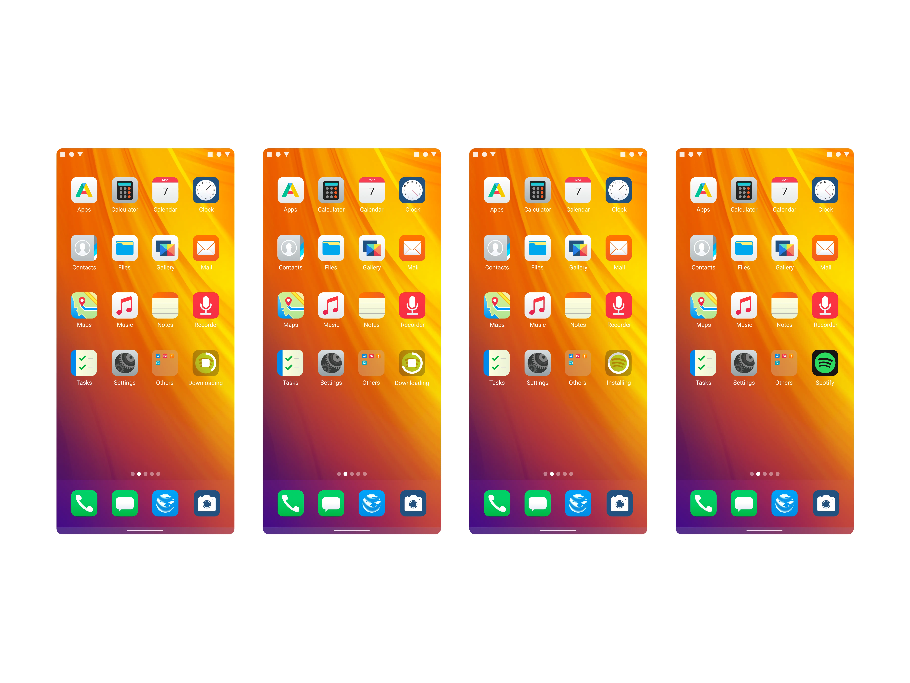
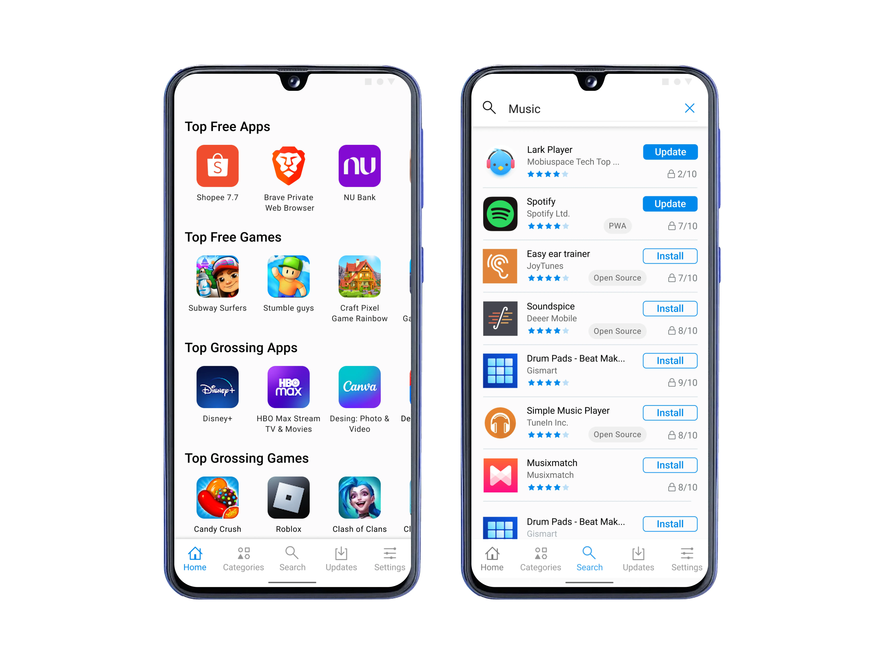
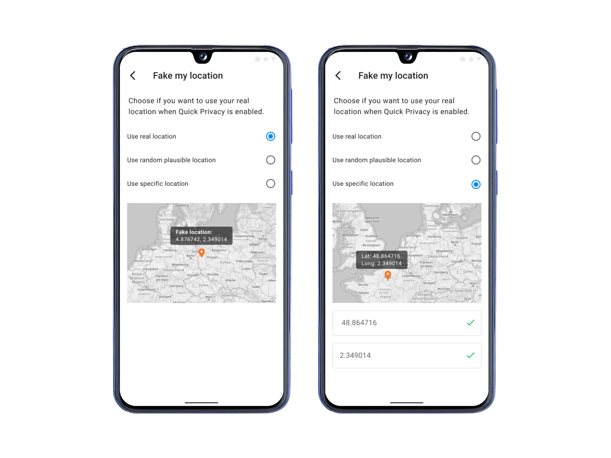

**Table of contents:**

1. [Preface](#preface)
2. [Objective](#objective)
3. [Research](#research)
4. [Proposed Solutions](#proposed-solution)
5. [User-centric Design Process](#user-centric-design-process)
    - [User Journey Map](#user-journey-map-eos)
    - [Plotting A Structure](#plotting-a-structure)
6. [Designing /e/OS](#designing-eos)
    - [Bliss Launcher](#revamping-home-with-bliss-launcher)
    - [App Lounge](#providing-users-with-a-fully-featured-app-store-with-app-lounge)
    - [Advanced Privacy](#providing-granular-control-over-privacy-via-privacy-dashboard)
    - [Cloud Integration](#giving-users-the-power-of-the-cloud-using-murena-cloud-integration-in-eos)
7. [Tests And Results](#tests-and-results)
8. [Challenges](#challenges-i-faced-while-working-on-this-project)
9. [Ending Note](#ending-note)

## Preface 

>/e/OS offers privacy without Google but can feel unfamiliar. As a UI/UX designer, I aimed to bridge the gap. Android’s strength is choice, and /e/OS provides a privacy-focused option. However, ditching Google disrupts the usual user experience. Our team tackled this by creating a familiar UI and workflow.

Why /e/OS? Because Google Android is not privacy-friendly, the primary objective of Google is to profit from ads and tracking, which increases the risk for people journalists, minorities, and people who need privacy. Google is the largest threat when it comes to privacy, but they are a big part of the Android experience. Luckily we have designed a solution.

**Animated using After Effects**

>We kept core Android features while incorporating custom solutions for missing Google apps. The result? It is a comfortable experience even for Android switchers. Users get familiar features with the freedom of privacy and control. This unique balance attracts users who value both.
My roles in this project

- Design the UI and the UX with my team.
- Design the visuals and assets.
- Design prototypes.
- Assist the developers responsible for the implementation of the designs.

Team:

Mahbub Hasan (myself, Junior UI/UX designer), Rhandros Dembicki (Design lead)

## Objective

To provide users of /e/OS with all the necessary tools to live a Google-free life and control their device privacy without any technical expertise.

## Research

We sent questionnaires and had direct interviews with our users. We collected hundreds of user survey responses. We also looked at our community and forum feedback and discussions. We finally did some one-to-one interviews to understand the user journey and specific challenges. 87% of the users previously used an Android as their primary OS. After analyzing the reports, we listed the challenges we should solve.

- **Lack of good first time experience:** When people think /e/OS, they should not think of custom roms with expert mode difficulty, but the tools and process needed for that were missing.
- **Bad home experience:** Most of the home launcher features are missing including search and bad default widgets in /e/OS.
- **Missing app ecosystem:** There was no app store due to the removal of core Google frameworks, and no way to access previously purchased apps.
- **Missing core tools for managing privacy:** A centralized dashboard was missing for the essential and promised privacy controls.
- **Missing crucial settings and management options:** Missing account management, cloud features, backup and sync, and so on. 
- **Cloud features:** No Google Drive and Google One-like functionalities that backup photos, contacts, and calendars.

## Proposed solutions

After evaluating our team’s strength and size, we decided to take action to solve the problems and we came up with the following solutions:

- **Revamp the home launcher:** Adding functionalities like search and widgets without Google dependencies with familiar navigation, home screen features, and customization in /e/OS.
- **Provide users with an app store:** We planned to design an app store that will allow any users to install apps securely without an account, but they can also use their Google account to access apps they purchased in Google Play. 
- **Provide granular control over privacy:** We planned to design a user-friendly and non-technical way to provide granular control over privacy.
- **Provide cloud features:** To provide access to crucial features like mail, calendar, backups and sync, photo backups, and storage; we, with the help of Murena Cloud, designed ways users can have all the things Google account and Google One do without Google. 

## User-centric design process

For starters, we categorized user types from the survey and made a few kinds of user personas according to their needs and objectives with /e/OS. Let’s meet our personas:

|User Riju|User Sidon| User Yunobo|
|---|---|---|
|  |  |  |

---
_click to view image_

We have created common points taken from the experience of the users. We have made the persona Riju as our proto persona analyzing the data and we have noted the emotional experience they have gone through.

### User Journey Map: /e/OS

_click to view image_

### Plotting a structure

After discussing how we will start the design process, we first made an ideal structure that we want to build into /e/OS. This is also a navigation workflow we want to provide for the users to let them quickly get access to the most important parts of their workflow on /e/OS.

_click to view image_

## Designing /e/OS

We started designing the UI and interaction designs after discussions, whiteboarding and sketching. 

### Revamping home with Bliss Launcher

> We designed Bliss Launcher to solve bad home experiences in /e/OS. Bliss Launcher is the first thing users see when they unlock /e/OS. It’s their home, so we made it feel like it.

**Bliss Launcher Universal Search Interface**

Universal search replaces Google Search for both in-device search and web searches. Web search is powered by Spot.

**Bliss launcher customizable sidebar**

We have designed Bliss Launcher sidebar to organize a space for themselves with their favorite widgets. It also contains a search bar and suggested applications.

**Decorate your Bliss Launcher**

Users can **color their home screen** with their favorite wallpapers. **Add widgets to the home screen**, **change their lock screen wallpaper**, and more. We kept it simple, but not limited.

**Bliss Launcher reacts to system activities**

As part of our mission is to provide an integrated system, **App Lounge app installation progress** can be tracked from your home screen. You can also cancel the installation process right from there.

**Assets:** We have done more than the eyes meet in the first look. Lots of **tiny detailing, icons, animations and interactions** were added to make Bliss Launcher look and feel good. Often simplicity is a complex matter.

### Providing users with a fully featured app store with App Lounge

> App Lounge is an important part of /e/OS experience. This solves one of the major issues with Google-free Android. App Lounge equips /e/OS with the same power as the Google Play Store, but with essential interfaces and tools for managing privacy.

**Browse or search for your favorite apps**

App Lounge is designed to enable users to Install their favorite apps by browsing the categories or searching instead of sideloading or using third party unsecure sources. /e/OS is based on Android, and **App Lounge is the Google free alternative for the Play Store.**

**Acess Play Store catalog + F-droid in the same store**

To provide a Google-free alternative, sources like F-droid are used. We designed App Lounge to include Google Play Store apps and F-droid so users don't have to use two apps and have a unified experience. It also promotes alternatives for Google-dependent applications. 

**Take decision based on reality**

We have brainstormed over effective ways to show our users if an application is privacy-friendly in conjunction with user ratings. We have designed a separate indicator for how privacy-respecting an application is, with scores and explanations.

**Giving the users power to re-install purchased apps**

Users can access apps that they previously purchased using a Google Play account. Users can install purchased apps, and can also purchase apps from Google Play through App Lounge.

**Assets:** App Lounge is a big application with tons of components and custom-made assets. Here are some of the icons I have designed for App Lounge.

### Providing granular control over privacy via Privacy Dashboard

> We designed Advanced Privacy to provide ultimate control of user privacy. It provides users with a UI and UX that will allow them to understand and take actions regarding privacy, without knowing anything technical.

**Easy to control UI**

We made it easy and actionable when it comes to controlling their privacy, from controlling trackers to managing their internet activity policy.

**See live tracker activities**

We designed uncomplicated charts to see tracker activities and the ability to disable trackers in one click and provide users with ultimate control over individual application trackers.

**Control app permission**

We designed /e/OS Advanced Privacy so users don’t have to rely on trust solely, they have control over how much access they want to give to a specific app.

**Easily manage internet activities**

We made sure that users can not only choose to be anonymous on the internet, but they can also change the country they want to show to the other side. They can also choose which apps should the settings be applied to.

**Hide GPS footprint easily**

We made hiding users’ IP addresses easy with Advanced Privacy, as does hiding their GPS footprint. Cloak their global position using a random position. You can use the interactive map for a location, or enter a co-ordinate.

### Giving users the power of the cloud using Murena Cloud integration in /e/OS

**Manage Murena Cloud account and synchronization**

With the power of Murena Cloud users can synchronize their data privately across devices without needing a Google account. However, we provided the necessary user experience for when users need to add existing accounts to sync their calendars and other data.

**Sync everything**

We also designed a Murena Cloud integration flow where the account will sync across the default apps such as **Mail, Calendar, Contact, Files, Gallery, Notes, To-do**, and so on.

## Tests and results

After beta testing and manual QA, /e/OS was out for all users After v1 and v1.5 updates was pushed out respectively, we got back to the user community and also looked at update delivery data. 

- 95%+ opted for the new update for their specific devices
- Good reviews from partner communities and social media
- 97%+ Positive response from our interviewed users who updated /e/OS to the newly designed version. 

## Challenges I faced while working on this project

- **Lack of similar projects as inspiration:** This is the most unique project I have done so far, and when I designed for /e/OS there was a lack of similar projects. For example, a competition of /e/OS is Graphene OS which exists as a specialized OS and we don’t want /e/OS to be like that. To solve it, I had to break down the goals and design each component drawing from individual apps existing on the market.
- **Lack of industry effort on privacy-first design:** Designing a user-friendly experience while keeping privacy in mind is a big challenge industry-wide. We solved it by talking to experts and taking notes.
- **Keeping brand identity intact but keeping Material Design guidelines in place:** Integrating branding into Material Design is a challenge. Many discussions and collaboration from the technical team were needed to ensure maintaining strict branding while working with Material Design.

## Ending note

While designing, I have come across a lot of new challenges, and I learned a lot of things to enhance my ability and equip myself with the knowledge for the future. This is my biggest project till now, and I’m proud of my effort to bring users comfort and excitement. Thousands of icons, hundreds of screens, and uncountable visual designs later I have gained much courage to take on new things.

**Thank you very much for checking out my work.**
