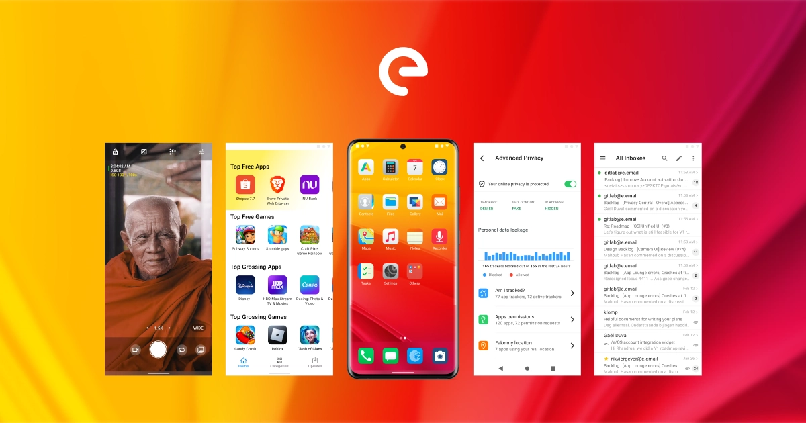
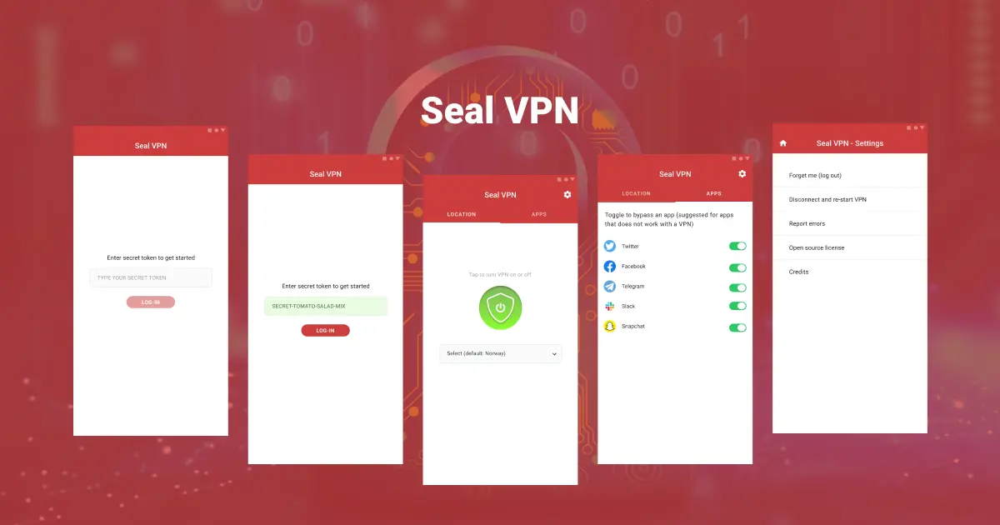
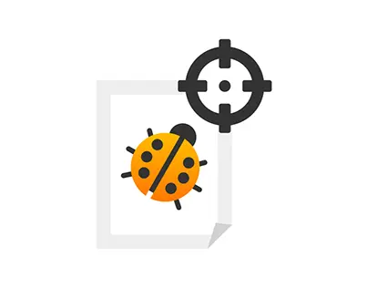
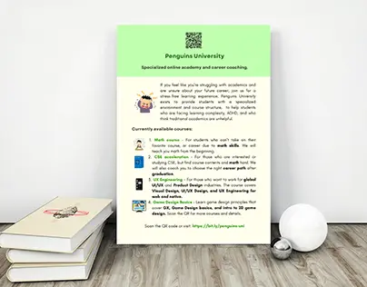
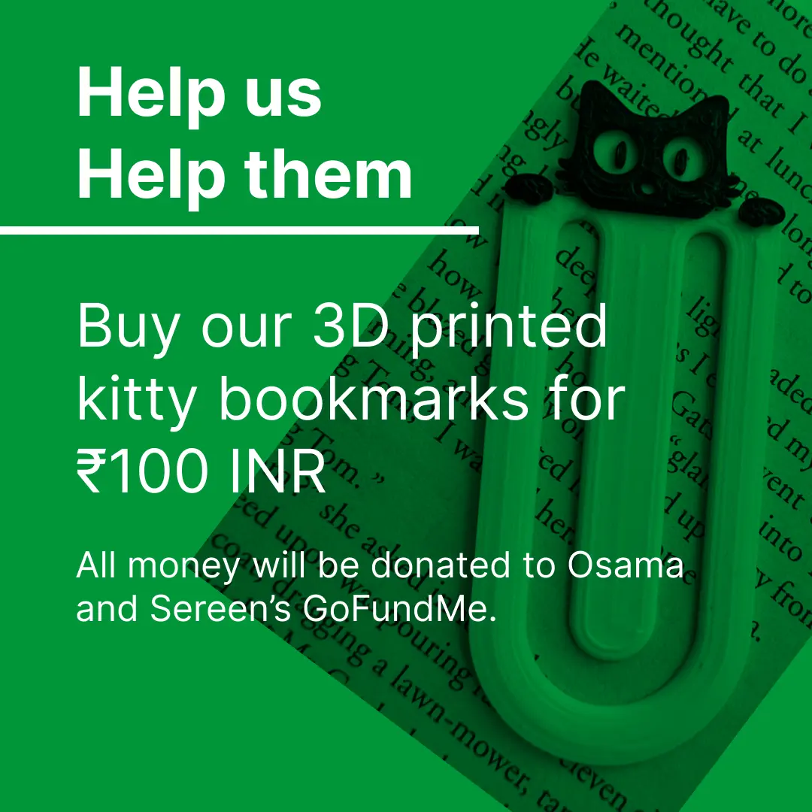
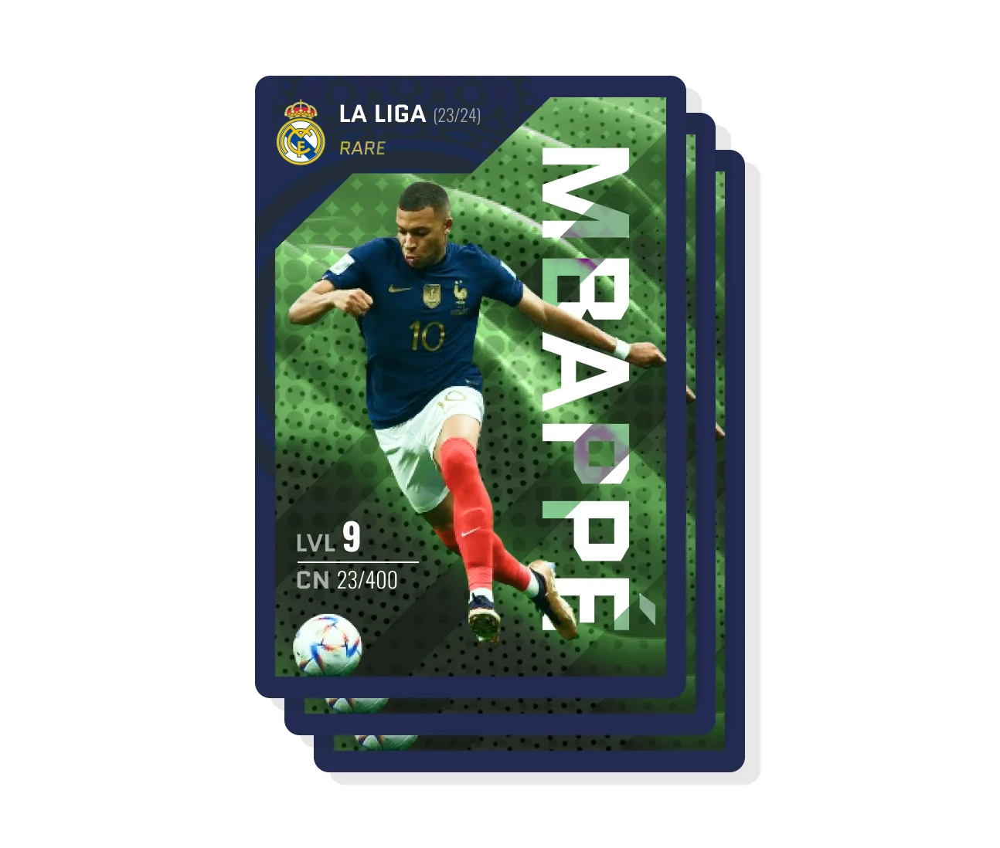

Hi,I'm Mahbub Hasan, a skilled designer. My expertise lies in UI/UX and visual design, but I also have experience in print design, communications design, and application asset/resource design. Below are some of my most notable projects.

# My projects

[UI/UX Design: Designing /e/OS - Bringing users home](/eos)

Murena /e/OS is a privacy-enabled mobile operating system. This is my biggest project to date. This is a very complex project with many parts, and I am extremely proud to be part of its design process, from continuous research to the design and development loop. The goal was to make /e/OS usable for day to day usage without Google's applications, while giving the users control over their privacy.

---

[UI Design: Seal VPN UI Design Project](/sealvpn)

Seal VPN is an internal security tool designed to replace a complex and unfriendly application previously used, with a simple and easy-to-use application. The goal was to provide friendly and intuitive AI that encourages team members to equip security protocol for confidential communications and data exchange.

## Other small design projects

Click on images for full behance project page

|Preview | Description |
|---|---|
|| Logo design for a bug bounty program (2022) |
|| Animated infographics showing how much data Google collect from each vendors. (2021) |
|  | Leaflet design for Penguins University, an online personalized education platform (2024) |
| <a target="_blank" href="https://www.behance.net/gallery/210505465/Kitties-for-Watermelon-Project-Instagram-banners"> | Kitties for watermelon instagram post for fundraising (2024) |
| <a target="_blank" href="https://www.behance.net/gallery/210506619/Football-trading-card-design"> | Football trading card design for an Upwork client in Figma (2024) |

*Portfolio is being updated constantly*