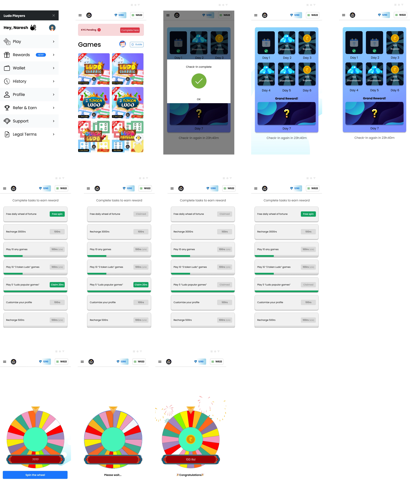

## Preface

Ludo Player is an online mobile game. The development team was tasked to implement daily check-in and rewards features. I was contracted to make the UI design for the project. 

Project type: Small gig

Project time: 24 hours

Tools used: Figma, Inkscape (for making SVG assets)

## Objective

The objective is to implement daily check-in and a rewards system for Ludo Player as a method to reward regular gamers and boost commitments. The following problems are presented. 

* Players who has not won any games quit for longer period if they lose more than a couple of time
* There is a downtrend of players logging in daily
* Players are hesitant to try new games added to the platform due to no incentive to try them

_Terminilogy: "Game" means one of many available games in Ludo Player platform_

## UI design requirements

* Make daily check-ins rewarding by making a daily check-in rewards system
* Reward players for doing certain tasks and playing new games
* Do an A/B test on daily check-in rewards to see which method shows the most balance result

## Designs

Here is the interactive prototype that shows the design

<iframe style="border: 1px solid rgba(0, 0, 0, 0.1);" width="800" height="450" src="https://www.figma.com/embed?embed_host=share&url=https%3A%2F%2Fwww.figma.com%2Fproto%2F5dDZ5RireDKsHaNWPKf7XR%2FRewards-Mechanism-LP%3Ftype%3Ddesign%26node-id%3D1-94%26t%3DeTPJFGO1Y0EIG1Rs-1%26scaling%3Dscale-down%26page-id%3D0%253A1%26starting-point-node-id%3D1%253A94%26mode%3Ddesign" allowfullscreen></iframe>

**Static images**

_Click to zoom_

## Assets

