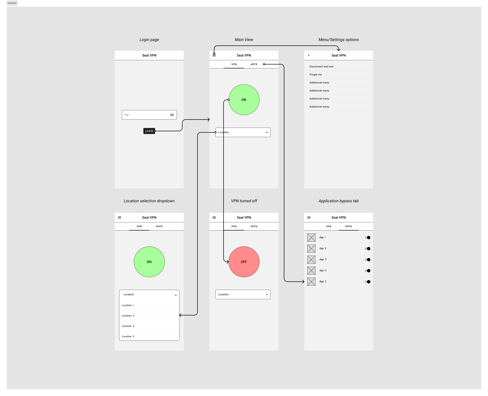
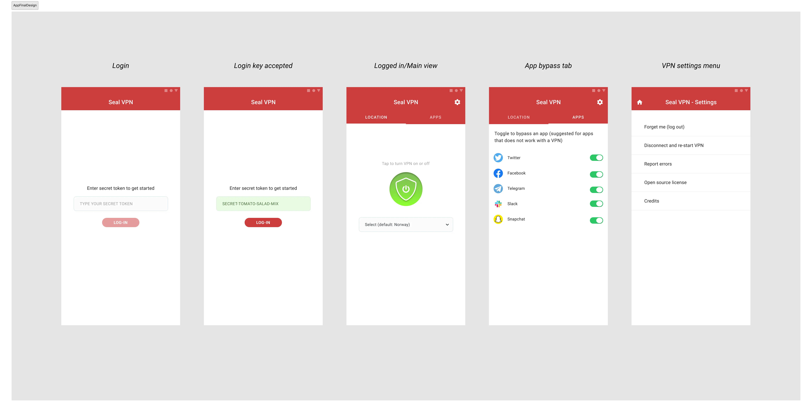

**Table of contents**

1. [Requirements](#requirements)
    - [Additional details](#additional-details)
3. [Designing Seal VPN UI](#designing-seal-vpn-ui)
    - [Brand gudelines](#brand-guidelines)
    - [Low fidelity wireframe](#lo-fidelity-wireframe)
    - [High fidelity design](#hi-fidelity-design)
    - [Prototype](#prototype)
    - [Tests](#tests)
4. [Conclusion](#conclusion)

## Requirements

Seal VPN is an internal security tool for Techno FAQ. A VPN is essential to secure confidential communications and securely exchange data in a business environment.

**Problems:** Clients previously used applications WireGuard mobile app requires quite some technical know-how for your marketing department or PR to use.

**AS you can see, the setup process of WireGuard Mobile is extremely hard for an average user.** Client requires an easy to use, simple "tap and go" style with additional features. 

**Sorted requirements:** I compressed the clients requirements into the following:

1. The UI needs to be simple and easy to oeprate
2. Login is secret token based
3. There should be an option for bypassing VPN tunneling for specific apps
4. There should be an option for disconnecting, resetting login key

### Additional details

- **Design and prototype tool:** Figma
- **Platform**: Android (native)
- **Design guideline**: Material Design
- **Timeline**: 1 week

## Designing Seal VPN UI

I first drafted a design requirements in text to break down features needed. Then I designed a minimal wireframe to gather feedbacks. 

### Brand guidelines

We gathered brand guidelines from the client in order to incorporate brand identity in the design. We used their branding and mixed it with highly flexible Material design in order to make a beautiful and minimal application that will also be aligned with the clients brand identity.

### Lo fidelity Wireframe

The client helped me with clear requirements and feedback on the wireframe. We finally agreed on a workflow and layout for Seal VPN UI. 

*Click on the photo to zoom*

### Hi fidelity design

After cleaning and adhering to material design, and continous feedback from the developer team, we polished the final design and simplified a lot of things. We also focused on micro interactions and animations of the application. 

*Click on the photo to zoom*

### Prototype

Play with the prototype and test the flow and animations (powered by Figma embedded prototype)

<iframe style="border: 1px solid rgba(0, 0, 0, 0.1);" width="800" height="450" src="https://www.figma.com/embed?embed_host=share&url=https%3A%2F%2Fwww.figma.com%2Fproto%2FgGyslu6Yc4Xna9LO7xccXU%2FSeal-VPN-UI-mockup%3Fnode-id%3D126-1585%26t%3Dwz8ara7McmvCuzDW-1%26scaling%3Dscale-down%26content-scaling%3Dfixed%26page-id%3D0%253A1%26starting-point-node-id%3D126%253A1603" allowfullscreen></iframe>

Here is the flow connections

### Tests

We conducted tests and interviews of the users who will use this application internally after development. 100% of the users could just login and use it from get go, where previously they had to consult IT department for help. The security risk has also been lowered and people are more interested in using the VPN app with the new application. 

## Conclusion

Internal tools often requires special care due to specific use case and catered experience. The client has reached me to design UI for their new VPN application with the requirement to make it simple and easy to use. And I was excited to work on it.

**Thank you so much for reading the entry, and have a nice day**